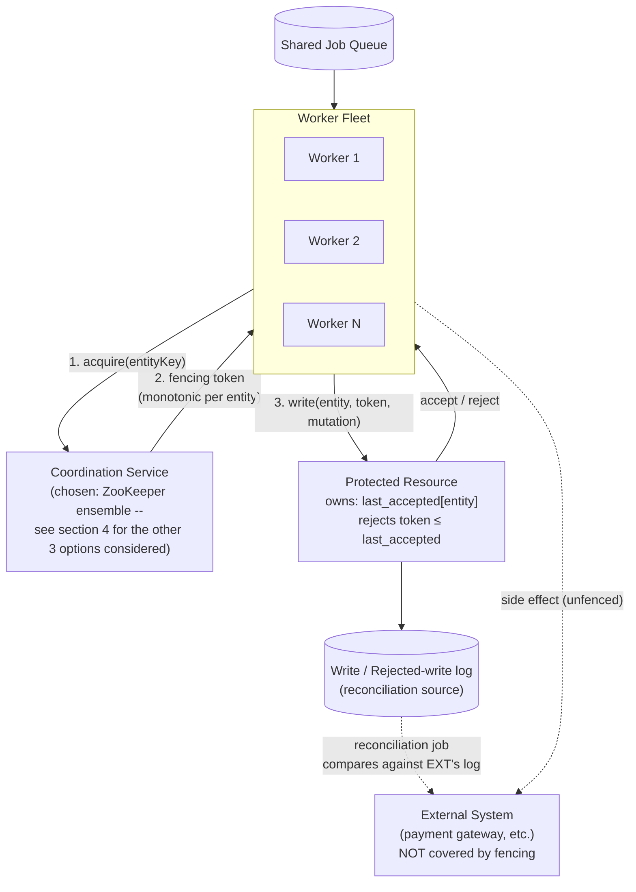
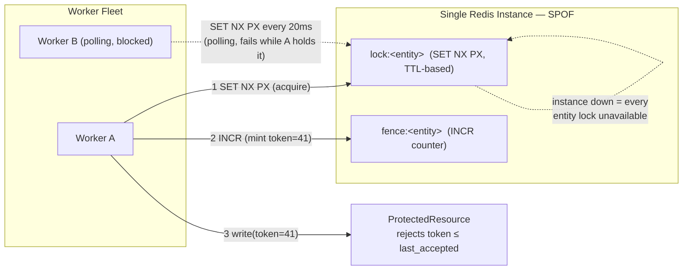
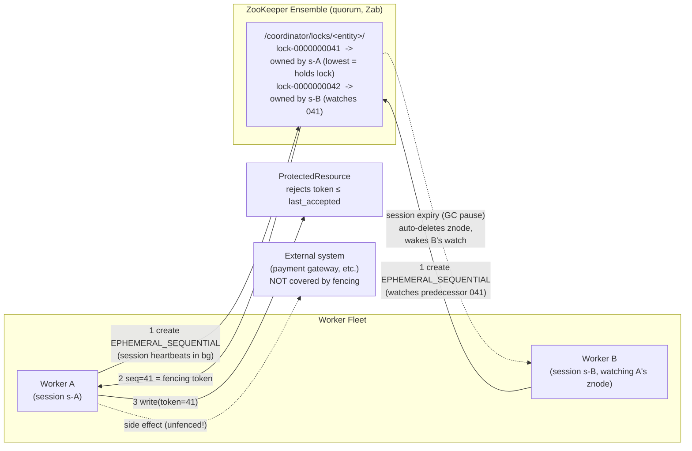
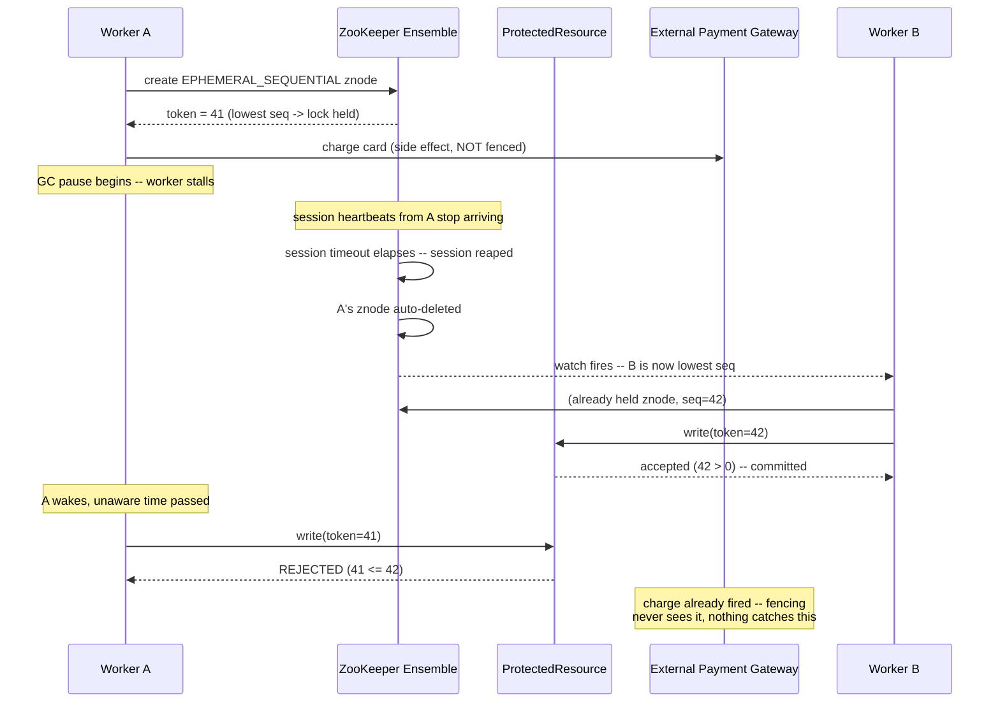

# The Coordinator — Design Note

## 1. Functional requirements

- **FR1.** A worker must be able to acquire exclusive coordination
  rights ("the lock") on a specific entity key before it touches the
  protected resource for that entity.
- **FR2.** A worker must be able to release the lock once it's done.
- **FR3.** If a worker dies or stalls without releasing, the lock must
  become available to other workers automatically — no permanent
  deadlock, ever, regardless of how the worker failed.
- **FR4.** Every successful acquisition produces a **fencing token**:
  a value that is unique and strictly increasing per entity key, usable
  by the protected resource to detect and reject stale writes.
- **FR5.** The protected resource must reject any write whose fencing
  token is not strictly greater than the last token it accepted for that
  entity — regardless of what the writer believes about its own lock
  status.
- **FR6.** Locking is per-entity: contention on one entity key must not
  block workers operating on a different, unrelated entity key.
- **FR7.** Many workers may contend for the same entity concurrently;
  exactly one makes progress at a time, and losers either wait or are
  correctly rejected — never silently ignored.
- **FR8.** Rejected writes must be observable (an audit trail), so a
  reconciliation process can detect whether a fenced-out worker's side
  effects landed somewhere else anyway.
- **FR9.** A worker performing a long-running job must be able to renew
  its claim on the lock without losing exclusivity, for backends where
  that's a meaningful operation.
- **FR10.** The system must remain correct under the assignment's stated
  operating conditions: workers that stall for unbounded, unknowable
  time; a network that delays and reorders requests; clocks that drift
  and step; job durations that vary from sub-second to TTL-brushing.

## 2. Non-functional requirements

- **NFR1 — Safety (highest priority).** No write is ever accepted for an
  entity out of fencing order, under any combination of worker stall,
  network delay, or clock skew. This takes priority over every NFR below
  — an available-but-unsafe coordinator is worse than an unavailable one
  for a billing ledger.
- **NFR2 — Fencing-token durability.** The token source must never
  reissue or roll back a previously-issued value, including across a
  leader/primary failover of the coordination service itself.
- **NFR3 — Availability of the coordination service.** No single node
  failure in the coordination layer should make entity locking
  unavailable fleet-wide. (In tension with NFR2 for some backends — see
  section 4.)
- **NFR4 — Acquisition latency.** Lock acquire/release should complete
  within a bounded, predictable window under normal (non-contended)
  load. Target: low-single-digit milliseconds for Redis-backed paths,
  tens of milliseconds for ZooKeeper-backed paths (consensus round-trip
  is the floor).
- **NFR5 — Throughput / scale.** The design must support at minimum
  thousands of distinct, independently-locked entity keys and tens of
  concurrently contending workers per hot entity without degrading
  correctness or falling over.
- **NFR6 — Dead-worker detection latency.** Bounded and tunable per
  workload class; explicitly allowed to trade against NFR2/NFR3 (see the
  TTL/session-timeout discussion in section 7).
- **NFR7 — Observability.** Lock acquisition latency, contention/wait
  time, session or TTL expirations, and rejected-write counts must be
  visible to operators, not just correct in code.
- **NFR8 — Operability.** The coordination service must be deployable,
  monitorable, and recoverable using standard tooling for whatever
  backend is chosen — not a bespoke, unfamiliar operational surface.
- **NFR9 — Testability against real faults.** The design must be
  verifiable against actual process stalls and network partitions, not
  only application-level timing tricks (`Thread.sleep`), before being
  trusted in production.
- **NFR10 — Fairness (soft).** Waiting workers should be served roughly
  in arrival order where the backend allows it cheaply — not a
  correctness requirement, but a quality-of-service one.

## 3. Entities

| Entity | Description |
|---|---|
| **Entity key** | The logical thing being protected — an account ID, document ID, inventory SKU. The unit of exclusion; locks on different entity keys never contend. |
| **Worker** | One instance in the fleet, pulling jobs off a shared queue. May stall, crash, or run long; has no reliable way to know its own liveness from the outside. |
| **Job** | A unit of work a worker performs against an entity, spanning acquire → do work → write → release. |
| **Lock (`EntityLockManager` / `AcquiredEntityLock`)** | The coordination handle tying one worker to one entity key for a bounded period. Backend-specific underneath (TTL key vs. session-scoped ephemeral znode), backend-agnostic at this interface. |
| **Fencing token** | A value scoped to one entity key, strictly increasing, issued once per successful acquisition. The actual safety mechanism — see section 7, "the guarantee." |
| **Coordination service** | The external system issuing locks and fencing tokens: a single Redis instance, a Redis Cluster/Sentinel deployment, a Redlock quorum, or a ZooKeeper ensemble (section 4). |
| **Protected resource (`ProtectedResource`)** | The stand-in for the real shared resource (billing ledger, document store, inventory record). Owns the fencing check and the durable per-entity high-water mark (`last_accepted`). |
| **Write record / rejected-write record** | Audit entries — every accepted and every rejected write, with entity, token, writer ID, and timestamp — the raw material for reconciliation (FR8). |
| **External system** | Anything a worker calls mid-job that isn't `ProtectedResource` (e.g. a payment gateway). Explicitly *not* covered by fencing — see "the failure you can't prevent at the lock." |

### High-level design

## 4. Approaches considered

Four coordination-service options were evaluated against the
requirements above. Three are rejected, with trade-offs and pros/cons
stated explicitly, not just named and dismissed; the fourth is what this
repo implements as the primary path.

### 4.1 Option 1 — Single-instance Redis

One Redis process. `SET NX PX` to acquire the lock, a separate `INCR`
counter for the fencing token. Implemented (`RedisLock`, `Simulate`) —
kept as the rejected baseline.

**Trade-offs:** no fault tolerance (hard SPOF, not degraded — down);
fencing-token durability holds only because there's no failover to roll
back to; best raw latency of the four (one round trip, no consensus);
lowest operational footprint; minimum reclaim time freely tunable to
low-hundreds-of-ms at the cost of clock-skew/jitter risk; liveness needs
a manual heartbeat this repo never wires up.

| Pros | Cons |
|---|---|
| Simplest to build and operate | Hard SPOF — violates NFR3 outright |
| Lowest latency of any option (NFR4) | Fencing durability only holds absent failover (NFR2 fails once you add HA) |
| Fencing token natively present (`INCR`) | Acquisition is polling — wastes CPU/network under contention |
| Fully implemented and verified (20/20 scenario runs) | No automatic liveness renewal — long jobs indistinguishable from dead workers as shipped |

### 4.2 Option 2 — Redis Cluster / Sentinel

Adds replicas and automatic failover to fix option 1's SPOF. Not
implemented — reasoned through and rejected.

**Trade-offs:** real fault tolerance via failover, but default
replication is asynchronous, so a promoted replica can hand out a
fencing token already issued before the crash, on *any* ordinary
failover — not a rare catastrophic case. `WAIT` forces synchronous
acknowledgment and closes the gap, at the cost of added latency on every
lock operation. Redis Cluster's hash-slot model also complicates the
two-key (lock + fence) scheme unless colocated with hash tags.

| Pros | Cons |
|---|---|
| Fixes option 1's SPOF (helps NFR3) | Async replication can roll back the fencing token on failover (breaks NFR2) |
| `WAIT` can close the durability gap | `WAIT` adds latency to every op (hurts NFR4) — you pay ZooKeeper-like cost without ZooKeeper's guarantee |
| Familiar Redis operational model | Multi-key hash-slot subtlety is an easy, silent way to get this wrong |
| — | Real operational complexity added for a property still not fully closed by default |

### 4.3 Option 3 — Redlock

Quorum-based locking across N independent Redis instances, Redis's own
proposal for multi-instance correctness without a full cluster. Not
implemented — reasoned through and rejected.

**Trade-offs:** real fault tolerance via quorum, but the safety argument
depends on bounded clock drift and bounded execution time — exactly what
the assignment's operating conditions rule out. No native fencing token;
Kleppmann's critique is that without one, a paused client can resume and
write after being legitimately superseded — the same double-write this
whole design exists to prevent. Bolting a token on doesn't fully close
this unless the counter itself is as durable as the lock, which
reintroduces option 2's problem. It's also a genuinely disputed design in
the community (Kleppmann vs. Sanfilippo), not settled practice.

| Pros | Cons |
|---|---|
| Fault tolerant via quorum across N nodes | Safety leans on bounded clock drift/pause duration — violates FR10/NFR1's own premise |
| No full cluster needed | No native fencing token; needs one bolted on to be safe at all |
| — | Contested in the literature — a bad foundation for a billing ledger |
| — | Highest operational complexity of the Redis-family options |

### 4.4 Option 4 — ZooKeeper (chosen, implemented as primary)

A distributed coordination service purpose-built for this problem.
Implemented as `ZooKeeperLock`, `AcquiredZkLock`, `ZkSimulate`.

**Trade-offs:** fencing token is the ephemeral znode's sequence number,
assigned atomically as part of the replicated log (Zab) — cannot be
reissued lower with quorum intact, closing the exact gap options 1–3
share. Liveness is an automatically-heartbeated session, not a manual
TTL. Highest per-op latency of the four (every op is a consensus round).
Session-timeout floor is seconds, not sub-second. Hand-rolled client
here (vs. Curator) trades production robustness for algorithm
visibility.

| Pros | Cons |
|---|---|
| Fencing token structurally can't roll back on failover (satisfies NFR2 outright) | Highest per-operation latency of the four (hurts NFR4) |
| Automatic session heartbeat — no app code needed for liveness (helps FR9, NFR6) | Session-timeout floor is seconds, driven by ensemble `tickTime` — can't hit sub-second dead-worker detection |
| Watch-driven acquisition — no polling, no herd effect (helps NFR5) | Fencing-token width is 32-bit per parent znode — a real, if unlikely, wraparound limit |
| Real quorum fault tolerance (satisfies NFR3 properly) | Raw client is a known footgun (session-state handling, watch semantics) — Curator recommended for production |
| Fully implemented and independently verified (30/30 scenario runs) | Ensemble is a real operational surface to run and monitor (cost of NFR3) |

### 4.5 Requirements traceability: which option satisfies what

| Requirement | Opt 1: Single Redis | Opt 2: Redis Cluster/Sentinel | Opt 3: Redlock | Opt 4: ZooKeeper |
|---|---|---|---|---|
| NFR1 Safety | ✅ (while up) | ⚠️ breaks on failover by default | ⚠️ contested without add-ons | ✅ |
| NFR2 Fencing durability | ✅ (no failover to roll back) | ❌ unless `WAIT` used | ❌ unless bolted on | ✅ structural |
| NFR3 Coordination-service availability | ❌ hard SPOF | ✅ | ✅ | ✅ |
| NFR4 Acquisition latency | ✅ best | ⚠️ good, worse with `WAIT` | ⚠️ N round trips | ⚠️ worst (consensus) |
| NFR5 Throughput/scale | ✅ | ✅ | ⚠️ | ✅ |
| NFR6 Dead-worker detection latency | ✅ sub-second tunable | ✅ sub-second tunable | ⚠️ depends on config | ⚠️ seconds floor |
| NFR8 Operability | ✅ simplest | ⚠️ moderate | ❌ most complex | ⚠️ real but standard |

Only option 4 gets a clean row on both NFR1 and NFR2 without an asterisk
— every other option either trades away safety/durability outright or
only recovers it by adding cost that erodes its own reason for existing
(options 2 and 3 both end up paying ZooKeeper-like tax without
ZooKeeper's guarantee).

### 4.6 The pick

**ZooKeeper**, because NFR2 (fencing-token durability across failover) is
the one requirement options 1–3 could not satisfy without either
accepting a SPOF (option 1), paying for a mitigation that erodes the
option's own value proposition (option 2's `WAIT`), or resting on a
disputed safety argument (option 3). NFR1, safety, was set as the
highest-priority requirement up front — the trade-offs given up to get
it (NFR4 latency, NFR6 sub-second detection) are the acceptable cost for
a billing-ledger-class problem. Single-instance Redis is kept in the
repo deliberately, as the concrete rejected baseline that makes the case
against options 1–3 legible instead of asserted.

## 5. Mitigating each trade-off — what's actually possible

Naming a drawback isn't the same as saying nothing can be done about it.
Here's what each option's core problem could be mitigated with, and what
that mitigation actually costs.

| Option | Core trade-off | Possible mitigation | Residual cost / risk |
|---|---|---|---|
| 1. Single Redis | Hard SPOF; no failover at all | Put Sentinel/Cluster in front of it | You've just built option 2, and inherited option 2's problem |
| 2. Redis Cluster/Sentinel | Async replication can roll a fencing token backward on failover | Issue `WAIT 1 <timeout>` after every `INCR`/`SET` before trusting it | Added round-trip latency on *every* lock operation; still not linearizable across every failure mode (e.g. split-brain during network partition) |
| 3. Redlock | Safety depends on bounded clock drift / bounded execution time, which the exercise rules out | Operationally bound clock drift (NTP monitoring + alerting) and bolt a fencing token onto the resource | Contested even with mitigations (see Kleppmann/Sanfilippo); the bolted-on counter still needs its own durability story, which is option 2's or option 4's problem again |
| 4. ZooKeeper | Session-timeout floor is seconds, not sub-second; hand-rolled client has known footguns; per-op latency is the highest of the four | Use Curator instead of a hand-rolled client for the footguns; for sub-second detection, consider a **hybrid**: Redis TTL lock for fast advisory exclusion, ZooKeeper-issued token as the actual fencing authority checked at the resource | The hybrid adds a second system to operate and a second thing to reason about the failure modes of — worth it only if sub-second dead-worker detection is a hard requirement, which for a billing ledger it wasn't judged to be |

The pattern across rows 1–3: every mitigation for a Redis-family option
either reduces to rebuilding a piece of what ZooKeeper already gives you
natively (a replicated, quorum-backed counter), or adds latency/operational
cost without closing the gap all the way. That asymmetry is the real
argument for option 4, more than any single bullet in the table above.

## 6. Implementation approaches

Two of the four options above are actually built, not just discussed.
This section covers how each is architected, and is honest about what's
good and bad about each as *implementations*, not just as abstract
trade-offs.

### Approach 1: Single-instance Redis lock (baseline, implemented)

**How it works:** a worker calls `RedisLock.acquire(entityKey, ttl, ...)`,
which does `SET lock:<entity> <owner> NX PX <ttl>` against one Redis
process. On success, it separately calls `INCR fence:<entity>` to mint a
fencing token, independent of the lock key's own TTL. Release is a
Lua-scripted compare-and-delete (`GET` then `DEL` only if the caller
still owns it), so a worker can never release a lock it no longer holds.

**Positives**
- Simple to reason about and cheap to run — one process, no consensus.
- Lowest latency of any option: one round trip per operation.
- Fully implemented and exercised in `Simulate` (baseline, high
  contention, stalled-worker scenarios), verified via
  `verify/verify_fencing.py` (20/20 scenario runs passed).

**Drawbacks**
- Hard SPOF, by construction (see option 1 above).
- Fencing token can roll back if this were ever put behind failover
  without the mitigation in the table above.
- Acquisition is polling (`SET NX` retried every 20ms) — wasted CPU and
  network under contention; a stated, uncorrected cut (see "what I'd do
  with more time").
- Liveness requires a manual heartbeat call that this repo never wires
  up (`JobRunner` doesn't call `extend()`), so a legitimately slow job is
  indistinguishable from a dead one here.

### Approach 2: ZooKeeper ensemble lock with native fencing (chosen, implemented)

**How it works:** a worker creates an `EPHEMERAL_SEQUENTIAL` znode under
`/coordinator/locks/<entity>/lock-`. The ensemble assigns it a sequence
number atomically as part of the replicated log — that number *is* the
fencing token, no separate counter needed. If the worker's znode has the
lowest sequence number among its siblings, it holds the lock; otherwise
it watches only its immediate predecessor (not the holder, not the whole
list) and waits. Liveness is the worker's ZooKeeper session, heartbeated
automatically in the background by the client library; the ephemeral
znode is deleted by the ensemble the moment that session expires,
waking the next waiter via its watch.

**Positives**
- Fencing token is native and failover-safe — closes the exact gap
  options 1–3 could not (see "the guarantee" below).
- Liveness is automatic; a merely-slow worker (blocked I/O, CPU-bound
  work) does not need any app-level renewal code, unlike Approach 1.
- Acquisition is watch-driven, not polling — no busy loop, no herd
  effect (only the immediate predecessor is watched).
- Fully implemented (`ZooKeeperLock`, `AcquiredZkLock`, `ZkSimulate`) and
  independently verified via `verify/verify_zk_fencing.py` (30/30
  scenario runs passed, including the session-expiry and
  slow-but-alive cases).

**Drawbacks**
- Highest per-operation latency of the four options — every znode
  create/delete is a Zab consensus round across the ensemble.
- Session-timeout floor is seconds, not sub-second (see the mitigation
  table above) — a worse fit if fast dead-worker detection matters more
  than failover-safety for a given workload.
- The client here is hand-rolled against the raw ZooKeeper API rather
  than Curator, specifically to keep the recipe visible for review — a
  reasonable call for this exercise, a real gap for production (session
  reconnection edge cases aren't handled as robustly as Curator would).
- The `docker-compose.yml` here runs a single ZooKeeper node for local
  convenience, which does **not** exercise the quorum fault-tolerance
  property that's the actual reason this option was chosen — see "what
  I'd do with more time."

**The failure this design still can't prevent, end to end** (walks
through "the failure you can't prevent at the lock," below, against this
specific implementation):

The ledger stays correct; the payment gateway charge does not, because
nothing in this design fences an external call. See "the failure you
can't prevent at the lock" for the full argument and the only real
backstop (idempotency keys threaded downstream, or reconciliation).

## 7. Required sections

### The guarantee

Precisely: **for a given entity key, the protected resource never applies
a write whose fencing token is not strictly greater than every token it
has already accepted for that entity.**

That is *not* "at most one worker executes the critical section at a
time" — the difference is the point of this exercise. `ZooKeeperLock`
alone only promises that at most one worker holds the lowest-sequence
ephemeral znode at a given instant; a worker can be descheduled — GC
pause, blocked syscall, CPU steal — for an unbounded, *unknowable* amount
of time while it still believes it holds the lock. Lock possession is
never mutual exclusion over the critical section; it's a claim about the
lock's own state, which a paused worker cannot observe.

The guarantee actually lives one layer up, at the resource, via the
fencing token: the sequence number ZooKeeper assigned the worker's znode
on creation, which only ever increases for a given entity regardless of
how many times the lock has been acquired, expired, or handed to a
waiting worker. `ProtectedResource.write()` rejects anything not strictly
greater than the last accepted token. This holds independent of clock
behavior, network delay, or worker stalls, **given two assumptions**:

1. **The fencing token source never rolls back.** For ZooKeeper this is
   structural: the sequence number is part of the replicated log itself
   and cannot be reissued lower as long as a quorum of the ensemble
   survives — see option 4 above for why this is the deciding factor
   over options 1–3. (The retained single-instance Redis path does *not*
   have this property — see option 1 — and should not be trusted for
   this guarantee if it's ever wired up for something real.)
2. **The fencing token is the sole authority for whether a write is
   allowed to land** — for every side effect the worker triggers, not
   just the call into `ProtectedResource`. This holds regardless of
   backend, and is exactly where it breaks; see the next section.

### The failure you can't prevent at the lock

Worker A acquires the lock and fencing token 41, then stalls
mid-critical-section — say, after it has already sent a request to an
external payment gateway. Its ZooKeeper session expires (the ensemble
stops seeing heartbeats); Worker B, already queued behind A, is woken via
watch, acquires token 42, does its work, writes with 42, releases. Worker
A wakes up with no awareness that time passed and tries to write with
41. The resource correctly rejects it: `41 ≤ 42`. The ledger stays
consistent. (See the sequence diagram in Approach 2 above for the full
walkthrough.)

But Worker A may already have caused an external side effect — the
payment gateway call — that had already fired and cannot be un-sent
through this mechanism. **That's the failure this design cannot prevent
at the lock: a non-idempotent side effect triggered by a worker who has
since been fenced out.** `ProtectedResource` only ever sees the write
attempt, not whatever the worker did on the way there. It's caught only
if the downstream system is itself idempotent, or if the fencing token is
threaded through to that call as an idempotency key, so the *external*
system does the rejecting instead of ours. Absent either, the only
backstop is reconciliation: an audit process comparing the external
system's log against `ProtectedResource`'s rejected-write log (kept for
exactly this reason) to catch what the lock couldn't. No coordination
service closes this gap — swapping between any of the four options above
does not touch it at all, which is itself worth naming: a better
primitive does not make a non-idempotent downstream call safe.

### The TTL decision

Both extremes are real and neither is free. **Too short:** a legitimate
long-running job loses its lock mid-flight; a second worker starts on the
same entity believing it has exclusivity; wasted work, and possibly a
non-idempotent side effect that already fired. **Too long:** a worker
that's actually dead holds the entity hostage before anyone else can
make progress — an availability cost, not a correctness one, but real.

**ZooKeeper's session model partially defuses this rather than solving
it.** Liveness is heartbeated automatically by the client library on its
own thread, so a worker that's merely slow (blocked on I/O, doing CPU
work) does not lose its lock — no manual renewal call anywhere in
`JobRunner`, because the heartbeat isn't coupled to the job's own
execution thread. This was verified directly (see "Verification"): a
worker that sleeps 4 seconds with zero manual renewal still commits under
ZooKeeper, closing the "someone forgot to wire up heartbeating" failure
mode by construction — exactly the failure mode the retained
single-instance Redis path in this repo actually has (`JobRunner` never
calls `AcquiredLock.extend()` there; see Approach 1 above). But it does
not touch the fundamental tension: a true GC-stop-the-world pause freezes
the heartbeat thread too, so a genuinely stalled worker still loses its
session. And ZooKeeper adds a version of "too short" that Redis doesn't
have: session timeout is negotiated against ensemble-configured bounds
(commonly a handful of seconds, driven by `tickTime`), so it generally
cannot be pushed into the low-hundreds-of-milliseconds range a Redis TTL
can.

So: **it depends on whether the workload's minimum acceptable
dead-worker-detection latency is above or below a few seconds.** If
sub-second detection is a hard requirement, ZooKeeper's session model is
a worse fit than a well-tuned, heartbeated Redis TTL, despite being
better on the failover-safety axis (option 4 vs. option 1 above) — the
hybrid row in the mitigation table (section 5) is the concrete answer if
you need both. For a billing ledger, failover-safe fencing mattered more
than sub-second reclaim, which is why option 4 was chosen regardless of
this cost.

**What's actually cut on the retained Redis path:** the harness uses a
fixed TTL and `JobRunner` never calls `extend()` — the heartbeat wiring
exists on `AcquiredLock` but isn't plugged into the worker loop. A
stated, deliberate cut for time, and one more reason that path is kept
as the rejected baseline rather than a real alternative.

### What you'd do with more time / in production

- **Run ZooKeeper as a real multi-node ensemble** (3 or 5 nodes) and
  actually test the failover-durability claim by killing a minority of
  nodes mid-run and confirming fencing tokens still never go backwards.
  The single-node `docker-compose.yml` here proves the algorithm, not the
  fault-tolerance property that's the entire reason option 4 was chosen
  over options 1–3.
- **Switch to Curator's `InterProcessMutex`** for production ZooKeeper
  usage instead of the hand-rolled `ZooKeeperLock` here, specifically for
  its handling of session-reconnection edge cases (a `Disconnected` event
  is not the same as `Expired`; a naive watcher can double-fire or miss
  events across a reconnect) that this simplified version does not
  handle. Hand-rolling it here was a reasonable call for this exercise
  (keeps the algorithm visible for review) and a bad one for production.
- **Propagate the fencing token downstream** as an idempotency key on any
  external call a worker makes mid-critical-section — "the failure you
  can't prevent at the lock" has no backstop today beyond being named in
  this doc.
- **Add reconciliation.** `ProtectedResource.rejected()` exists so an
  audit job can look for evidence that a rejected writer's side effects
  landed somewhere else anyway, and alert or compensate.
- **Consider the hybrid from section 5** if sub-second dead-worker
  detection turns out to be a real requirement for some entity classes:
  Redis TTL for fast advisory exclusion, ZooKeeper-issued sequence number
  as the actual fencing authority the resource checks.
- **Test against real faults, not `Thread.sleep()`/force-closed
  sessions.** The stalled-worker scenarios fake their failure with
  application-level timing tricks; a more honest suite would use
  `kill -STOP`/`-CONT` on a real worker process and something like
  Toxiproxy for actual network delay/partition between a worker and its
  coordination backend.
- **Run workers as separate processes,** not threads sharing one JVM
  object as "the resource" — proves the ordering logic but not real
  network reordering or a genuinely crashed process (as opposed to a
  `.close()` call) losing a ZooKeeper session.
- **Retire or clearly quarantine the single-instance Redis path** if this
  ever ships for real. It's kept in this repo deliberately, as the
  rejected baseline that makes the case for option 4 concrete rather than
  asserted — but "the code still exists and still works" is exactly how
  a rejected option quietly becomes the thing someone wires up under
  deadline pressure. Worth a comment at the top of `RedisLock` saying so
  in plain language, not just in this document.

## 8. Verification

Neither the ZooKeeper code (`ZooKeeperLock`, `AcquiredZkLock`) nor the
retained Redis code (`RedisLock`, `ProtectedResource`, `JobRunner`,
`InMemoryRedisClient`, `JedisRedisClient`) has been compiled or run
directly in the environments this was built in — no JDK compiler was
available, and no route to Maven Central to fetch either client jar. Both
have been reviewed line by line against their respective client APIs
(ZooKeeper 3.9.x, Jedis 5.x) from documentation and memory.

Beyond review, each locking algorithm was independently ported to Python
and actually executed, using the same fencing-check logic and the same
class of scenarios as the Java harnesses:

- `verify/verify_zk_fencing.py` (ZooKeeper/session model — the
  implemented, chosen path): baseline, high contention, a "slow but
  alive" worker that keeps its lock through a multi-second sleep with
  zero heartbeat calls, and a "session expired" case where a worker's
  session is force-expired mid-job and a queued second worker takes over
  via a watch. **30/30 runs passed**, including 10 runs of the
  session-expiry case, each producing exactly one commit and one
  rejection with the expected sequence-number tokens.
- `verify/verify_fencing.py` (Redis/TTL model — the retained, rejected
  baseline): baseline, high contention, and a stalled-worker case where a
  worker's token is rejected after another worker takes over past the
  TTL. **20/20 runs passed**, including 10 runs of the stalled-worker
  case.

That's real evidence both algorithms behave as claimed; it is not a
substitute for `mvn test` and running both harnesses against live
backends. Please do that before treating either path as final —
`ZooKeeperLock` and `JedisRedisClient` are the two classes whose
wire-level behavior against a live server hasn't been independently
exercised here, and the ZooKeeper session-timeout floor described above
in particular should be confirmed against whatever ensemble config is
actually used, not assumed from documentation.
