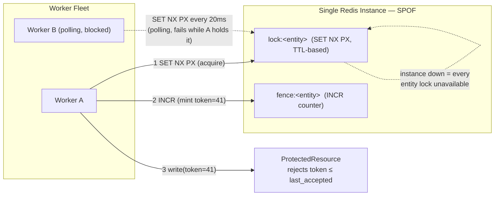
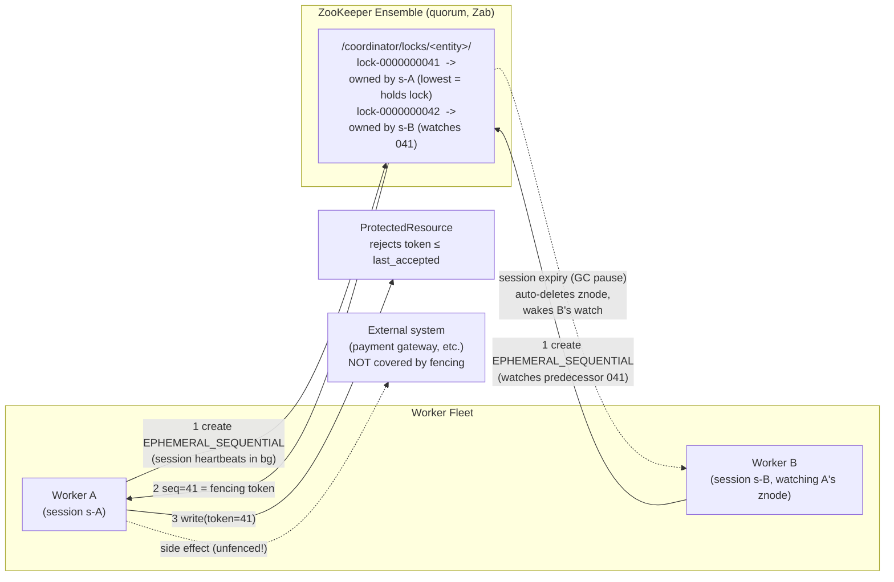
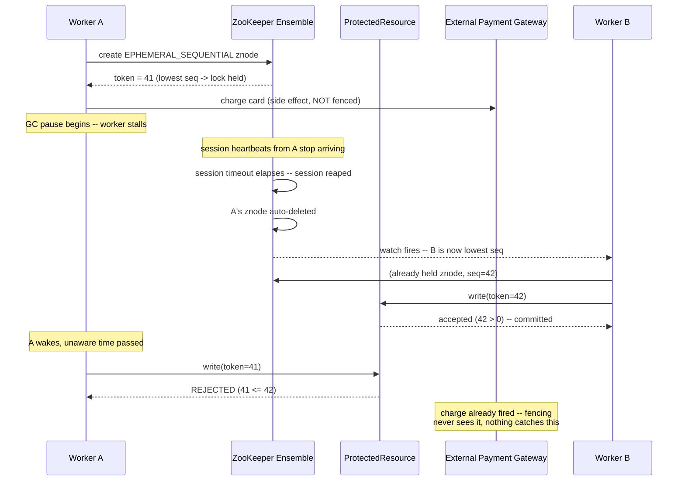

# The Coordinator — Design Note

## 1. Coordination service options, and the trade-offs of each

The assignment says "you can assume something Redis-like, or etcd/
ZooKeeper-like; your choice, state your assumption." Four concrete
options were actually on the table. Three are rejected below, with
reasons and trade-offs, not just named and dismissed; the fourth is what
this repo implements as the primary path.

### Option 1 — Single-instance Redis

One Redis process. `SET NX PX` to acquire the lock, a separate `INCR`
counter for the fencing token. This is the simplest thing that matches
the inherited note's "we've been running this for months and it's
basically fine," and it's implemented here (`RedisLock`, `Simulate`) —
kept in the repo as the rejected baseline, not the recommendation.

- **Fault tolerance:** none. A hard SPOF — not degraded, down. If the
  instance dies, every entity lock in the fleet is unavailable until it's
  back.
- **Fencing-token durability:** only "safe" because there's no failover
  to roll back to. The moment you add HA (option 2), this stops being
  true.
- **Latency / throughput:** best of the four — one round trip to one
  process, no consensus overhead.
- **Operational complexity:** lowest — nothing to run but Redis itself.
- **Liveness mechanism:** manual TTL renewal (`AcquiredLock.extend()`);
  in this repo, nothing calls it — a deliberate, named cut (see "the TTL
  decision" below).
- **Minimum reclaim time:** freely tunable, down to low hundreds of
  milliseconds, at the cost of clock-skew/jitter risk.
- **Where this would be fine:** dev/test, or a workload where an
  occasional full outage is tolerable and correctness never has to
  survive a failover, because there isn't one.

### Option 2 — Redis Cluster / Sentinel

The obvious fix for option 1's SPOF: add replicas and automatic
failover. Not implemented — reasoned through and rejected.

- **Fault tolerance:** real — survives node loss via automatic failover.
- **Fencing-token durability:** *worse* than option 1 in practice.
  Sentinel/Cluster replication is asynchronous by default; a write can be
  acknowledged to the client before a replica has it. On failover, the
  promoted replica may not have seen the last `INCR`, so a fencing token
  can be handed out lower than one already issued — the same rollback
  risk as option 1, except now it happens on *any ordinary failover*,
  not only in a rare, self-inflicted "restored from a stale backup"
  scenario.
- **Mitigation and its cost:** Redis's `WAIT` command can force
  synchronous replication acknowledgment before an `INCR` is trusted,
  closing the gap — at the cost of added latency on every lock
  operation. At that point you're paying most of the operational cost of
  a real coordination service without getting a native fencing token in
  return.
- **Multi-key complexity:** Redis Cluster's hash-slot model complicates
  the two-key (lock key + fence key) scheme used here unless the two are
  colocated via hash tags — a detail that's easy to get wrong silently.
- **Operational complexity:** real — a cluster/sentinel topology to run,
  monitor, and reason about failure modes for.
- **Where this would be fine:** workloads that need HA but don't share
  this design's specific correctness requirement — never for this
  problem, unless bent out of its default configuration with `WAIT`.

### Option 3 — Redlock

Redis's own proposed answer to "how do you get a correctness-oriented
lock out of multiple independent Redis instances without running a real
cluster": acquire the lock against a majority of N independent instances
within a bounded time budget. Not implemented — reasoned through and
rejected.

- **Fault tolerance:** real — quorum across N independent instances.
- **Safety assumptions:** relies on bounded clock drift and bounded
  execution time between acquiring and using the lock. The assignment's
  own "operating conditions" rule this out by name (GC pauses, clock
  steps, unbounded stalls) — Redlock's safety argument depends on exactly
  the thing this exercise says not to assume.
- **The fencing gap:** Martin Kleppmann's critique of Redlock is that
  without a fencing token, a paused client can resume and write after its
  lock has been legitimately taken over — the identical double-write
  problem this whole design exists to prevent. Bolting a token onto
  Redlock doesn't fully close this unless the counter itself is
  distributed with the same rigor as the lock, which reintroduces a
  version of the single-counter SPOF problem.
- **Contested design:** Salvatore Sanfilippo's rebuttal to Kleppmann is a
  legitimate read of the same trade-offs from the other side — which is
  itself the point. This is a genuinely disputed algorithm in the
  distributed-systems community, not a settled "just do this," and a
  disputed design is a bad foundation for a billing ledger.
- **Operational complexity:** highest of the Redis-family options — N
  independent instances, quorum logic, clock-budget accounting.
- **Where this would be fine:** workloads that need "probably exclusive,
  nobody's checking too closely" — not this one.

### Option 4 — ZooKeeper (chosen, implemented as the primary path)

A real distributed coordination service, purpose-built for this problem
rather than repurposed from a cache. Implemented as `ZooKeeperLock`,
`AcquiredZkLock`, `ZkSimulate`.

- **Fault tolerance:** real — quorum via ZooKeeper's Zab consensus
  protocol.
- **Fencing-token durability:** strongest of the four. The token is the
  sequence number assigned to an ephemeral znode on creation, atomically,
  as part of the replicated log itself — it cannot be reissued lower as
  long as a quorum of the ensemble survives. This is the exact property
  options 1–3 could not give without either accepting a SPOF or bending
  Redis out of its default configuration.
- **Liveness mechanism:** automatic, session-based heartbeat on a
  background client thread — no app-level renewal code needed. A merely
  slow (not dead) worker does not lose its lock, with nothing in
  `JobRunner` having to call anything to keep it alive.
- **Minimum reclaim time:** has a practical floor. Session timeout is
  negotiated against ensemble-configured bounds (commonly a handful of
  seconds, driven by `tickTime`) — it cannot generally be pushed into the
  low-hundreds-of-milliseconds range a Redis TTL can.
- **Latency / throughput:** worst of the four for raw lock operations —
  every znode create/delete is a Zab consensus round requiring a majority
  ack across the ensemble.
- **Acquisition mechanism:** watch-driven, not polling — a blocked
  acquirer watches exactly its immediate predecessor, avoiding both
  busy-polling and the herd effect.
- **Fencing-token width:** the per-parent sequence number is 32-bit; an
  entity locked roughly 2^31 times over its lifetime would wrap. Redis's
  `INCR` is 64-bit and won't realistically wrap. A real, if unlikely to
  matter, limitation this option has that option 1 doesn't.
- **Client maturity:** the raw ZooKeeper client is a known footgun
  (watch semantics, session-state handling, reconnection edge cases).
  `ZooKeeperLock` here hand-rolls the standard recipe to keep the
  algorithm visible for review; production usage should prefer Curator's
  `InterProcessMutex` (see "what I'd do with more time").
- **Operational complexity:** real — an ensemble to run and monitor,
  though this is the cost of the fault-tolerance and fencing-durability
  properties above, not overhead without payoff.
- **Where this would be fine:** exactly this problem — a shared resource
  where a rolled-back fencing token means a silent double charge, and
  sub-second dead-worker detection is not the top priority.

### The pick

ZooKeeper, specifically because of the fencing-token durability point:
it's the one gap options 1–3 all shared and none could close without
either accepting a SPOF or bolting on complexity the community itself
disputes the safety of. The original inherited design note's own
"production" instinct — move the fencing counter to etcd or ZooKeeper —
turns out to be the right call once you actually work through the other
three options rather than assuming it. This repo builds that, rather
than continuing to just recommend it. Single-instance Redis is also
implemented and kept in the repo, deliberately, as the concrete rejected
baseline that makes the case against options 1–3 legible instead of
asserted.

## 2. Mitigating each trade-off — what's actually possible

Naming a drawback isn't the same as saying nothing can be done about it.
Here's what each option's core problem could be mitigated with, and what
that mitigation actually costs — since "it depends" is only a real answer
if you say what it depends on.

| Option | Core trade-off | Possible mitigation | Residual cost / risk |
|---|---|---|---|
| 1. Single Redis | Hard SPOF; no failover at all | Put Sentinel/Cluster in front of it | You've just built option 2, and inherited option 2's problem |
| 2. Redis Cluster/Sentinel | Async replication can roll a fencing token backward on failover | Issue `WAIT 1 <timeout>` after every `INCR`/`SET` before trusting it | Added round-trip latency on *every* lock operation; still not linearizable across every failure mode (e.g. split-brain during network partition) |
| 3. Redlock | Safety depends on bounded clock drift / bounded execution time, which the exercise rules out | Operationally bound clock drift (NTP monitoring + alerting on skew) and bolt a fencing token onto the resource | Contested even with mitigations (see Kleppmann/Sanfilippo); the bolted-on counter still needs its own durability story, which is option 2's or option 4's problem again |
| 4. ZooKeeper | Session-timeout floor is seconds, not sub-second; hand-rolled client has known footguns; per-op latency is the highest of the four | Use Curator instead of a hand-rolled client for the footguns; for sub-second detection, consider a **hybrid**: Redis TTL lock for fast advisory exclusion, ZooKeeper-issued token as the actual fencing authority checked at the resource | The hybrid adds a second system to operate and a second thing to reason about the failure modes of — worth it only if sub-second dead-worker detection is a hard requirement, which for a billing ledger it wasn't judged to be |

The pattern across rows 1–3: every mitigation for a Redis-family option
either reduces to rebuilding a piece of what ZooKeeper already gives you
natively (a replicated, quorum-backed counter), or adds latency/operational
cost without closing the gap all the way. That asymmetry is the real
argument for option 4, more than any single bullet in the table above.

## 3. Implementation approaches

Two of the four options above are actually built, not just discussed.
This section covers how each is architected, and is honest about what's
good and bad about each as *implementations*, not just as abstract
trade-offs.

### Approach 1: Single-instance Redis lock (baseline, implemented)

**How it works:** a worker calls `RedisLock.acquire(entityKey, ttl, ...)`,
which does `SET lock:<entity> <owner> NX PX <ttl>` against one Redis
process. On success, it separately calls `INCR fence:<entity>` to mint a
fencing token, independent of the lock key's own TTL. Release is a
Lua-scripted compare-and-delete (`GET` then `DEL` only if the caller
still owns it), so a worker can never release a lock it no longer holds.

**Positives**
- Simple to reason about and cheap to run — one process, no consensus.
- Lowest latency of any option: one round trip per operation.
- Fully implemented and exercised in `Simulate` (baseline, high
  contention, stalled-worker scenarios), verified via
  `verify/verify_fencing.py` (20/20 scenario runs passed).

**Drawbacks**
- Hard SPOF, by construction (see option 1 above).
- Fencing token can roll back if this were ever put behind failover
  without the mitigation in the table above.
- Acquisition is polling (`SET NX` retried every 20ms) — wasted CPU and
  network under contention; a stated, uncorrected cut (see "what I'd do
  with more time").
- Liveness requires a manual heartbeat call that this repo never wires
  up (`JobRunner` doesn't call `extend()`), so a legitimately slow job is
  indistinguishable from a dead one here.

### Approach 2: ZooKeeper ensemble lock with native fencing (chosen, implemented)

**How it works:** a worker creates an `EPHEMERAL_SEQUENTIAL` znode under
`/coordinator/locks/<entity>/lock-`. The ensemble assigns it a sequence
number atomically as part of the replicated log — that number *is* the
fencing token, no separate counter needed. If the worker's znode has the
lowest sequence number among its siblings, it holds the lock; otherwise
it watches only its immediate predecessor (not the holder, not the whole
list) and waits. Liveness is the worker's ZooKeeper session, heartbeated
automatically in the background by the client library; the ephemeral
znode is deleted by the ensemble the moment that session expires,
waking the next waiter via its watch.

**Positives**
- Fencing token is native and failover-safe — closes the exact gap
  options 1–3 could not (see "the guarantee" below).
- Liveness is automatic; a merely-slow worker (blocked I/O, CPU-bound
  work) does not need any app-level renewal code, unlike Approach 1.
- Acquisition is watch-driven, not polling — no busy loop, no herd
  effect (only the immediate predecessor is watched).
- Fully implemented (`ZooKeeperLock`, `AcquiredZkLock`, `ZkSimulate`) and
  independently verified via `verify/verify_zk_fencing.py` (30/30
  scenario runs passed, including the session-expiry and
  slow-but-alive cases).

**Drawbacks**
- Highest per-operation latency of the four options — every znode
  create/delete is a Zab consensus round across the ensemble.
- Session-timeout floor is seconds, not sub-second (see the mitigation
  table above) — a worse fit if fast dead-worker detection matters more
  than failover-safety for a given workload.
- The client here is hand-rolled against the raw ZooKeeper API rather
  than Curator, specifically to keep the recipe visible for review — a
  reasonable call for this exercise, a real gap for production (session
  reconnection edge cases aren't handled as robustly as Curator would).
- The `docker-compose.yml` here runs a single ZooKeeper node for local
  convenience, which does **not** exercise the quorum fault-tolerance
  property that's the actual reason this option was chosen — see "what
  I'd do with more time."

**The failure this design still can't prevent, end to end** (walks
through "the failure you can't prevent at the lock," below, against this
specific implementation):

The ledger stays correct; the payment gateway charge does not, because
nothing in this design fences an external call. See "the failure you
can't prevent at the lock" for the full argument and the only real
backstop (idempotency keys threaded downstream, or reconciliation).

## 4. Required sections

### The guarantee

Precisely: **for a given entity key, the protected resource never applies
a write whose fencing token is not strictly greater than every token it
has already accepted for that entity.**

That is *not* "at most one worker executes the critical section at a
time" — the difference is the point of this exercise. `ZooKeeperLock`
alone only promises that at most one worker holds the lowest-sequence
ephemeral znode at a given instant; a worker can be descheduled — GC
pause, blocked syscall, CPU steal — for an unbounded, *unknowable* amount
of time while it still believes it holds the lock. Lock possession is
never mutual exclusion over the critical section; it's a claim about the
lock's own state, which a paused worker cannot observe.

The guarantee actually lives one layer up, at the resource, via the
fencing token: the sequence number ZooKeeper assigned the worker's znode
on creation, which only ever increases for a given entity regardless of
how many times the lock has been acquired, expired, or handed to a
waiting worker. `ProtectedResource.write()` rejects anything not strictly
greater than the last accepted token. This holds independent of clock
behavior, network delay, or worker stalls, **given two assumptions**:

1. **The fencing token source never rolls back.** For ZooKeeper this is
   structural: the sequence number is part of the replicated log itself
   and cannot be reissued lower as long as a quorum of the ensemble
   survives — see option 4 above for why this is the deciding factor
   over options 1–3. (The retained single-instance Redis path does *not*
   have this property — see option 1 — and should not be trusted for
   this guarantee if it's ever wired up for something real.)
2. **The fencing token is the sole authority for whether a write is
   allowed to land** — for every side effect the worker triggers, not
   just the call into `ProtectedResource`. This holds regardless of
   backend, and is exactly where it breaks; see the next section.

### The failure you can't prevent at the lock

Worker A acquires the lock and fencing token 41, then stalls
mid-critical-section — say, after it has already sent a request to an
external payment gateway. Its ZooKeeper session expires (the ensemble
stops seeing heartbeats); Worker B, already queued behind A, is woken via
watch, acquires token 42, does its work, writes with 42, releases. Worker
A wakes up with no awareness that time passed and tries to write with
41. The resource correctly rejects it: `41 ≤ 42`. The ledger stays
consistent. (See the sequence diagram in Approach 2 above for the full
walkthrough.)

But Worker A may already have caused an external side effect — the
payment gateway call — that had already fired and cannot be un-sent
through this mechanism. **That's the failure this design cannot prevent
at the lock: a non-idempotent side effect triggered by a worker who has
since been fenced out.** `ProtectedResource` only ever sees the write
attempt, not whatever the worker did on the way there. It's caught only
if the downstream system is itself idempotent, or if the fencing token is
threaded through to that call as an idempotency key, so the *external*
system does the rejecting instead of ours. Absent either, the only
backstop is reconciliation: an audit process comparing the external
system's log against `ProtectedResource`'s rejected-write log (kept for
exactly this reason) to catch what the lock couldn't. No coordination
service closes this gap — swapping between any of the four options above
does not touch it at all, which is itself worth naming: a better
primitive does not make a non-idempotent downstream call safe.

### The TTL decision

Both extremes are real and neither is free. **Too short:** a legitimate
long-running job loses its lock mid-flight; a second worker starts on the
same entity believing it has exclusivity; wasted work, and possibly a
non-idempotent side effect that already fired. **Too long:** a worker
that's actually dead holds the entity hostage before anyone else can
make progress — an availability cost, not a correctness one, but real.

**ZooKeeper's session model partially defuses this rather than solving
it.** Liveness is heartbeated automatically by the client library on its
own thread, so a worker that's merely slow (blocked on I/O, doing CPU
work) does not lose its lock — no manual renewal call anywhere in
`JobRunner`, because the heartbeat isn't coupled to the job's own
execution thread. This was verified directly (see "Verification"): a
worker that sleeps 4 seconds with zero manual renewal still commits under
ZooKeeper, closing the "someone forgot to wire up heartbeating" failure
mode by construction — exactly the failure mode the retained
single-instance Redis path in this repo actually has (`JobRunner` never
calls `AcquiredLock.extend()` there; see Approach 1 above). But it does
not touch the fundamental tension: a true GC-stop-the-world pause freezes
the heartbeat thread too, so a genuinely stalled worker still loses its
session. And ZooKeeper adds a version of "too short" that Redis doesn't
have: session timeout is negotiated against ensemble-configured bounds
(commonly a handful of seconds, driven by `tickTime`), so it generally
cannot be pushed into the low-hundreds-of-milliseconds range a Redis TTL
can.

So: **it depends on whether the workload's minimum acceptable
dead-worker-detection latency is above or below a few seconds.** If
sub-second detection is a hard requirement, ZooKeeper's session model is
a worse fit than a well-tuned, heartbeated Redis TTL, despite being
better on the failover-safety axis (option 4 vs. option 1 above) — the
hybrid row in the mitigation table (section 2) is the concrete answer if
you need both. For a billing ledger, failover-safe fencing mattered more
than sub-second reclaim, which is why option 4 was chosen regardless of
this cost.

**What's actually cut on the retained Redis path:** the harness uses a
fixed TTL and `JobRunner` never calls `extend()` — the heartbeat wiring
exists on `AcquiredLock` but isn't plugged into the worker loop. A
stated, deliberate cut for time, and one more reason that path is kept
as the rejected baseline rather than a real alternative.

### What you'd do with more time / in production

- **Run ZooKeeper as a real multi-node ensemble** (3 or 5 nodes) and
  actually test the failover-durability claim by killing a minority of
  nodes mid-run and confirming fencing tokens still never go backwards.
  The single-node `docker-compose.yml` here proves the algorithm, not the
  fault-tolerance property that's the entire reason option 4 was chosen
  over options 1–3.
- **Switch to Curator's `InterProcessMutex`** for production ZooKeeper
  usage instead of the hand-rolled `ZooKeeperLock` here, specifically for
  its handling of session-reconnection edge cases (a `Disconnected` event
  is not the same as `Expired`; a naive watcher can double-fire or miss
  events across a reconnect) that this simplified version does not
  handle. Hand-rolling it here was a reasonable call for this exercise
  (keeps the algorithm visible for review) and a bad one for production.
- **Propagate the fencing token downstream** as an idempotency key on any
  external call a worker makes mid-critical-section — "the failure you
  can't prevent at the lock" has no backstop today beyond being named in
  this doc.
- **Add reconciliation.** `ProtectedResource.rejected()` exists so an
  audit job can look for evidence that a rejected writer's side effects
  landed somewhere else anyway, and alert or compensate.
- **Consider the hybrid from section 2** if sub-second dead-worker
  detection turns out to be a real requirement for some entity classes:
  Redis TTL for fast advisory exclusion, ZooKeeper-issued sequence number
  as the actual fencing authority the resource checks.
- **Test against real faults, not `Thread.sleep()`/force-closed
  sessions.** The stalled-worker scenarios fake their failure with
  application-level timing tricks; a more honest suite would use
  `kill -STOP`/`-CONT` on a real worker process and something like
  Toxiproxy for actual network delay/partition between a worker and its
  coordination backend.
- **Run workers as separate processes,** not threads sharing one JVM
  object as "the resource" — proves the ordering logic but not real
  network reordering or a genuinely crashed process (as opposed to a
  `.close()` call) losing a ZooKeeper session.
- **Retire or clearly quarantine the single-instance Redis path** if this
  ever ships for real. It's kept in this repo deliberately, as the
  rejected baseline that makes the case for option 4 concrete rather than
  asserted — but "the code still exists and still works" is exactly how
  a rejected option quietly becomes the thing someone wires up under
  deadline pressure. Worth a comment at the top of `RedisLock` saying so
  in plain language, not just in this document.

## 5. Verification

Neither the ZooKeeper code (`ZooKeeperLock`, `AcquiredZkLock`) nor the
retained Redis code (`RedisLock`, `ProtectedResource`, `JobRunner`,
`InMemoryRedisClient`, `JedisRedisClient`) has been compiled or run
directly in the environments this was built in — no JDK compiler was
available, and no route to Maven Central to fetch either client jar. Both
have been reviewed line by line against their respective client APIs
(ZooKeeper 3.9.x, Jedis 5.x) from documentation and memory.

Beyond review, each locking algorithm was independently ported to Python
and actually executed, using the same fencing-check logic and the same
class of scenarios as the Java harnesses:

- `verify/verify_zk_fencing.py` (ZooKeeper/session model — the
  implemented, chosen path): baseline, high contention, a "slow but
  alive" worker that keeps its lock through a multi-second sleep with
  zero heartbeat calls, and a "session expired" case where a worker's
  session is force-expired mid-job and a queued second worker takes over
  via a watch. **30/30 runs passed**, including 10 runs of the
  session-expiry case, each producing exactly one commit and one
  rejection with the expected sequence-number tokens.
- `verify/verify_fencing.py` (Redis/TTL model — the retained, rejected
  baseline): baseline, high contention, and a stalled-worker case where a
  worker's token is rejected after another worker takes over past the
  TTL. **20/20 runs passed**, including 10 runs of the stalled-worker
  case.

That's real evidence both algorithms behave as claimed; it is not a
substitute for `mvn test` and running both harnesses against live
backends. Please do that before treating either path as final —
`ZooKeeperLock` and `JedisRedisClient` are the two classes whose
wire-level behavior against a live server hasn't been independently
exercised here, and the ZooKeeper session-timeout floor described above
in particular should be confirmed against whatever ensemble config is
actually used, not assumed from documentation.
