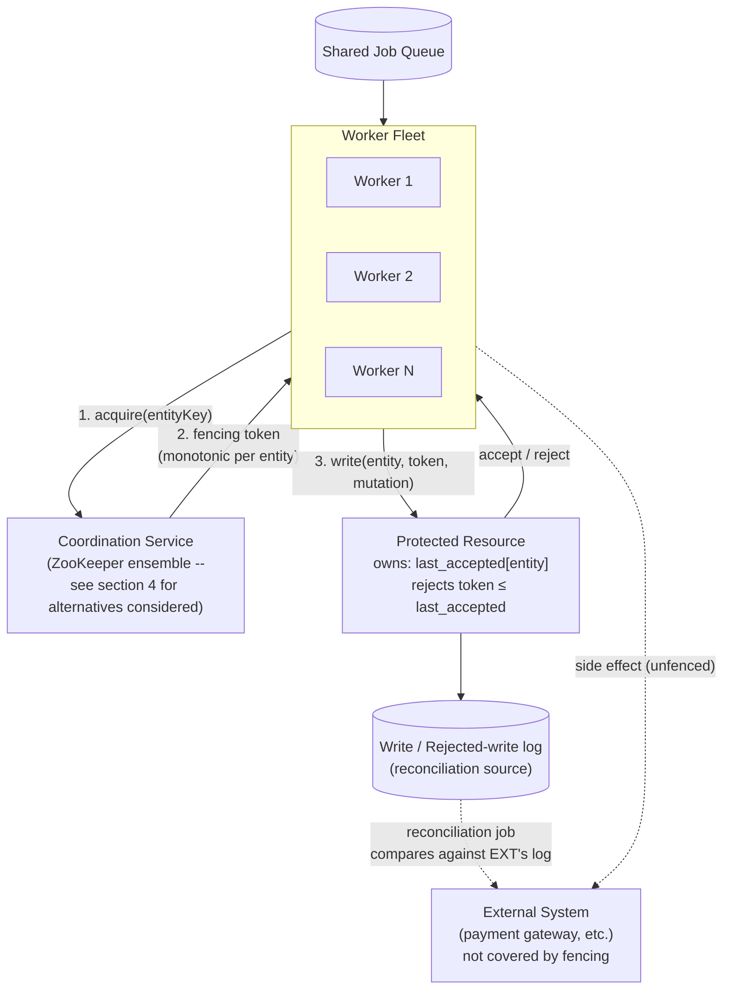
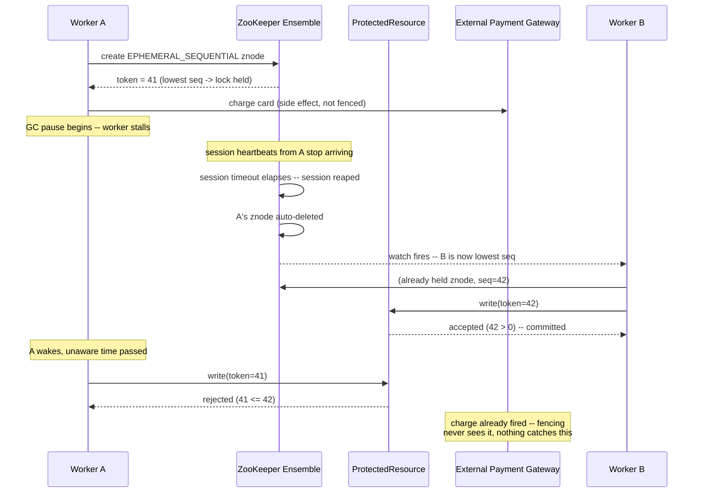

# The Coordinator — Design Note

A worker fleet processes jobs from a shared queue; some jobs touch a
shared external resource (a billing ledger, a document store, an
inventory record) where two workers acting on the same entity at the
same time causes real, visible corruption — double charges, lost
writes, duplicated shipments. This note covers the coordination
component that prevents that, the reasoning behind the specific
approach chosen, and where its guarantee actually stops.

**Assumption stated up front:** the coordination service itself isn't
fixed by the problem — the fleet could plausibly run against something
Redis-like or something etcd/ZooKeeper-like. Section 4 treats that
choice as the central design decision rather than a given, evaluates
four concrete options against the requirements below, and picks one.
Everything after section 6 describes the chosen option specifically.

## 1. Functional requirements

- A worker must be able to acquire exclusive coordination rights ("the
  lock") on a specific entity key before it touches the protected
  resource for that entity.
- A worker must be able to release the lock once it's done.
- If a worker dies or stalls without releasing, the lock must become
  available to other workers automatically. No permanent deadlock,
  regardless of how the worker failed.
- Every successful acquisition produces a fencing token: a value that
  is unique and strictly increasing per entity key, usable by the
  protected resource to detect and reject stale writes.
- The protected resource must reject any write whose fencing token is
  not strictly greater than the last token it accepted for that entity,
  regardless of what the writer believes about its own lock status.
- Locking is per-entity. Contention on one entity key must not block
  workers operating on a different, unrelated entity key.
- Many workers may contend for the same entity concurrently. Exactly
  one makes progress at a time, and losers either wait or are correctly
  rejected, never silently ignored.
- Rejected writes must be observable through an audit trail, so a
  reconciliation process can detect whether a fenced-out worker's side
  effects landed somewhere else anyway.
- A worker performing a long-running job must be able to renew its
  claim on the lock without losing exclusivity, for backends where
  that's a meaningful operation.
- The system must remain correct under realistic operating conditions:
  workers that stall for unbounded, unknowable time; a network that
  delays and reorders requests; clocks that drift and step; job
  durations ranging from sub-second to long-running.

## 2. Non-functional requirements

- Safety, highest priority: no write is ever accepted for an entity out
  of fencing order, under any combination of worker stall, network
  delay, or clock skew. This takes priority over everything below. An
  available but unsafe coordinator is worse than an unavailable one for
  a billing ledger.
- Fencing-token durability: the token source must never reissue or roll
  back a previously issued value, including across a leader or primary
  failover of the coordination service itself.
- Availability of the coordination service: no single node failure in
  the coordination layer should make entity locking unavailable across
  the fleet. This is in tension with fencing-token durability for some
  backends, discussed in the approaches section below.
- Acquisition latency: lock acquire and release should complete within
  a bounded, predictable window under normal, uncontended load. Target
  is low single-digit milliseconds for Redis-backed paths and tens of
  milliseconds for ZooKeeper-backed paths, where the consensus
  round-trip sets the floor.
- Throughput and scale: the design must support, at minimum, thousands
  of distinct, independently locked entity keys and tens of
  concurrently contending workers per hot entity, without degrading
  correctness or falling over.
- Dead-worker detection latency: bounded and tunable per workload
  class, and explicitly allowed to trade against durability and
  availability (see the timeout strategy section below).
- Observability: lock acquisition latency, contention and wait time,
  session or TTL expirations, and rejected-write counts must be visible
  to operators, not just correct in code.
- Operability: the coordination service must be deployable, monitored,
  and recoverable using standard tooling for whichever backend is
  chosen, not a bespoke or unfamiliar operational surface.
- Testability against real faults: the design must be verifiable
  against actual process stalls and network partitions, not only
  application-level timing tricks, before it's trusted in production.
- Fairness (soft): waiting workers should be served roughly in arrival
  order where the backend allows it cheaply. Not a correctness
  requirement, a quality-of-service one.

## 3. Entities

| Entity | Description |
|---|---|
| Entity key | The logical thing being protected: an account ID, document ID, inventory SKU. The unit of exclusion; locks on different entity keys never contend. |
| Worker | One instance in the fleet, pulling jobs off a shared queue. May stall, crash, or run long; has no reliable way to know its own liveness from the outside. |
| Job | A unit of work a worker performs against an entity, spanning acquire, do work, write, release. |
| Lock (`EntityLockManager` / `AcquiredEntityLock`) | The coordination handle tying one worker to one entity key for a bounded period. Backend-specific underneath (TTL key vs. session-scoped ephemeral znode), backend-agnostic at this interface. |
| Fencing token | A value scoped to one entity key, strictly increasing, issued once per successful acquisition. The actual safety mechanism (section 7). |
| Coordination service | The external system issuing locks and fencing tokens: a single Redis instance, a Redis Cluster/Sentinel deployment, a Redlock quorum, or a ZooKeeper ensemble (section 4). |
| Protected resource (`ProtectedResource`) | The stand-in for the real shared resource — billing ledger, document store, inventory record. Owns the fencing check and the durable per-entity high-water mark (`last_accepted`). |
| Write record / rejected-write record | Audit entries: every accepted and every rejected write, with entity, token, writer ID, and timestamp. The raw material for reconciliation. |
| External system | Anything a worker calls mid-job that isn't `ProtectedResource`, e.g. a payment gateway. Not covered by fencing (section 8). |

### High-level design

## 4. Approaches considered

Four coordination-service options were evaluated against the
requirements above. Three are rejected below, with trade-offs and
pros/cons stated explicitly rather than just named and dismissed. The
fourth is what this system implements as the primary path.

### 4.1 Option 1 — Single-instance Redis

One Redis process. `SET NX PX` to acquire the lock, a separate `INCR`
counter for the fencing token. Not implemented in this repository;
reasoned through and rejected as a documented baseline, not the
recommendation.

Trade-offs: no fault tolerance (hard SPOF, not degraded, down);
fencing-token durability holds only because there's no failover to roll
back to; best raw latency of the four (one round trip, no consensus);
lowest operational footprint; minimum reclaim time freely tunable to
low hundreds of milliseconds at the cost of clock-skew and jitter risk;
liveness needs a manual heartbeat this build never wires up.

| Pros | Cons |
|---|---|
| Simplest to build and operate | Hard SPOF, a clear availability risk |
| Lowest latency of any option | Fencing durability only holds while there's no failover |
| Fencing token natively present via `INCR` | Acquisition is polling, wastes CPU and network under contention |
| — | No automatic liveness renewal without extra application code |

### 4.2 Option 2 — Redis Cluster / Sentinel

Adds replicas and automatic failover to fix option 1's single point of
failure. Not implemented, reasoned through and rejected.

Trade-offs: real fault tolerance via failover, but default replication
is asynchronous, so a promoted replica can hand out a fencing token
already issued before the crash, on any ordinary failover, not just a
rare catastrophic case. `WAIT` forces synchronous acknowledgment and
closes the gap, at the cost of added latency on every lock operation.
Redis Cluster's hash-slot model also complicates the two-key (lock plus
fence) scheme unless the two are colocated with hash tags.

| Pros | Cons |
|---|---|
| Fixes option 1's single point of failure | Async replication can roll back the fencing token on failover |
| `WAIT` can close the durability gap | `WAIT` adds latency to every operation, paying most of a real coordination service's cost without its guarantee |
| Familiar Redis operational model | Multi-key hash-slot subtlety is an easy, silent way to get this wrong |
| — | Real operational complexity added for a property that still isn't closed by default |

### 4.3 Option 3 — Redlock

Quorum-based locking across several independent Redis instances,
Redis's own proposal for multi-instance correctness without a full
cluster. Not implemented, reasoned through and rejected.

Trade-offs: real fault tolerance via quorum, but the safety argument
depends on bounded clock drift and bounded execution time, which this
system's operating conditions rule out. There is no native fencing
token; the well-known critique of Redlock (Kleppmann) is that without
one, a paused client can resume and write after being legitimately
superseded, the same double-write this whole design exists to prevent.
Bolting a token on doesn't fully close this unless the counter itself
is as durable as the lock, which reintroduces option 2's problem. It's
also a genuinely disputed design in the wider community (see Kleppmann
vs. Sanfilippo), not settled practice.

| Pros | Cons |
|---|---|
| Fault tolerant via quorum across several nodes | Safety leans on bounded clock drift and pause duration, which contradicts the safety requirement's own premise |
| No full cluster needed | No native fencing token; needs one bolted on to be safe at all |
| — | Contested in the wider literature, a shaky foundation for a billing ledger |
| — | Highest operational complexity of the Redis-family options |

### 4.4 Option 4 — ZooKeeper (chosen, implemented as primary)

A distributed coordination service purpose-built for this problem.
Implemented as `ZooKeeperLock`, `AcquiredZkLock`, `ZkSimulate`.

Trade-offs: the fencing token is the ephemeral znode's sequence number,
assigned atomically as part of the replicated log (Zab), so it cannot
be reissued lower with quorum intact, closing the exact gap options 1
through 3 share. Liveness is an automatically heartbeated session, not
a manual TTL. Highest per-operation latency of the four, since every
operation is a consensus round. Session-timeout floor is measured in
seconds, not sub-second. The client used here is hand-rolled rather
than built on Curator, trading production robustness for algorithm
visibility.

| Pros | Cons |
|---|---|
| Fencing token structurally can't roll back on failover | Highest per-operation latency of the four |
| Automatic session heartbeat, no app code needed for liveness | Session-timeout floor is seconds, driven by ensemble `tickTime`; can't hit sub-second dead-worker detection |
| Watch-driven acquisition, no polling, no herd effect | Fencing-token width is 32-bit per parent znode, a real if unlikely wraparound limit |
| Real quorum fault tolerance | Raw client is a known source of footguns (session-state handling, watch semantics); Curator recommended for production |
| Fully implemented and independently verified across test scenarios | An ensemble is a real operational surface to run and monitor |

### 4.5 Requirements traceability

| Requirement | Single Redis | Redis Cluster/Sentinel | Redlock | ZooKeeper |
|---|---|---|---|---|
| Safety | Yes, while up | Breaks on failover by default | Contested without add-ons | Yes |
| Fencing-token durability | Yes, no failover to roll back | No, unless `WAIT` used | No, unless bolted on | Yes, structurally |
| Coordination-service availability | No, hard SPOF | Yes | Yes | Yes |
| Acquisition latency | Best | Good, worse with `WAIT` | Several round trips | Worst, consensus-bound |
| Throughput / scale | Good | Good | Fair | Good |
| Dead-worker detection latency | Sub-second tunable | Sub-second tunable | Depends on config | Seconds floor |
| Operability | Simplest | Moderate | Most complex | Real, but standard tooling |

Only ZooKeeper gets a clean row on both safety and fencing-token
durability without a caveat. Every other option either trades away
safety or durability outright, or only recovers it by adding cost that
erodes its own reason for existing — options 2 and 3 both end up paying
a ZooKeeper-like tax without ZooKeeper's guarantee.

### 4.6 The pick

ZooKeeper, because fencing-token durability across failover is the one
requirement options 1 through 3 could not satisfy without either
accepting a single point of failure (option 1), paying for a mitigation
that erodes the option's own value (option 2's `WAIT`), or resting on a
disputed safety argument (option 3). Safety was set as the
highest-priority requirement up front; the trade-offs given up to get
it (raw latency, sub-second detection) are an acceptable cost for a
billing-ledger-class problem. Single-instance Redis is documented here
deliberately, as a concrete baseline that makes the case against the
other options legible instead of asserted, even though only the chosen
approach is carried into the implementation in section 6.

## 5. Mitigation strategies

Naming a drawback isn't the same as saying nothing can be done about
it. Here's what each option's core problem could be mitigated with, and
what that mitigation actually costs.

| Option | Core trade-off | Possible mitigation | Residual cost / risk |
|---|---|---|---|
| Single Redis | Hard SPOF, no failover at all | Put Sentinel or Cluster in front of it | This just becomes option 2, and inherits option 2's problem |
| Redis Cluster/Sentinel | Async replication can roll a fencing token backward on failover | Issue `WAIT 1 <timeout>` after every `INCR`/`SET` before trusting it | Added round-trip latency on every lock operation; still not linearizable across every failure mode, e.g. a network partition |
| Redlock | Safety depends on bounded clock drift and execution time | Operationally bound clock drift with NTP monitoring and alerting, and bolt a fencing token onto the resource | Contested even with mitigations; the bolted-on counter still needs its own durability story, which is option 2's or option 4's problem again |
| ZooKeeper | Session-timeout floor is seconds; hand-rolled client has known footguns; per-operation latency is highest of the four | Use Curator instead of a hand-rolled client for the footguns; for sub-second detection, a hybrid: Redis TTL lock for fast advisory exclusion, ZooKeeper-issued token as the actual fencing authority checked at the resource | The hybrid adds a second system to operate and reason about — worth it only if sub-second dead-worker detection turns out to be a hard requirement |

Across the Redis-family rows, every mitigation either rebuilds a piece
of what ZooKeeper already gives natively (a replicated, quorum-backed
counter), or adds latency and operational cost without fully closing
the gap. That asymmetry is the real argument for ZooKeeper, more than
any single row above.

## 6. Implementation details

Section 4 weighs all four candidate coordination services; only the one
actually chosen is built out here. This section covers how it's
architected, and is candid about what's good and bad about it as an
implementation, not just as an abstract trade-off.

### ZooKeeper ensemble lock with native fencing

How it works: a worker creates an `EPHEMERAL_SEQUENTIAL` znode under
`/coordinator/locks/<entity>/lock-`. The ensemble assigns it a sequence
number atomically as part of the replicated log; that number is the
fencing token, no separate counter needed. If the worker's znode has
the lowest sequence number among its siblings, it holds the lock;
otherwise it watches only its immediate predecessor (not the holder,
not the whole list) and waits. Liveness is the worker's ZooKeeper
session, heartbeated automatically in the background by the client
library; the ephemeral znode is deleted by the ensemble the moment
that session expires, waking the next waiter through its watch.

Positives:
- Fencing token is native and failover-safe, closing the gap options 1
  through 3 could not (section 7).
- Liveness is automatic; a merely slow worker, blocked on I/O or doing
  CPU-bound work, does not need any app-level renewal code the way a
  TTL-based lock would.
- Acquisition is watch-driven rather than polling, no busy loop, no
  herd effect since only the immediate predecessor is watched.
- Implemented (`ZooKeeperLock`, `AcquiredZkLock`, `ZkSimulate`, and a
  small Spring Boot HTTP wrapper in `springapp/`) and independently
  verified via `verify/verify_zk_fencing.py`, including session-expiry
  and slow-but-alive scenarios.

Drawbacks:
- Highest per-operation latency of the four options; every znode
  create or delete is a consensus round across the ensemble.
- Session-timeout floor is seconds, not sub-second, a worse fit if fast
  dead-worker detection matters more than failover safety for a given
  workload.
- The client here is hand-rolled against the raw ZooKeeper API rather
  than Curator, to keep the recipe visible for review. Reasonable for
  now, a real gap before production (session reconnection edge cases
  aren't handled as robustly as Curator would).
- `docker-compose.yml` here runs a single ZooKeeper node for local
  convenience, which doesn't exercise the quorum fault-tolerance
  property that's the actual reason this option was chosen (section
  10).

The failure this design still can't prevent, end to end:

The ledger stays correct; the payment gateway charge does not, because
nothing in this design fences an external call. Section 8 covers the
full argument and the only real backstop: idempotency keys threaded
downstream, or reconciliation.

## 7. Consistency guarantee

The precise guarantee: for a given entity key, the protected resource
never applies a write whose fencing token is not strictly greater than
every token it has already accepted for that entity.

That's a narrower claim than "at most one worker executes the critical
section at a time," and the difference matters. `ZooKeeperLock` alone
only promises that at most one worker holds the lowest-sequence
ephemeral znode at a given instant. A worker can be descheduled by a GC
pause, a blocked syscall, or CPU contention for an unbounded, unknowable
amount of time while it still believes it holds the lock. Lock
possession is not mutual exclusion over the critical section; it's a
claim about the lock's own state, which a paused worker can't observe.

The guarantee actually lives one layer up, at the resource, through the
fencing token: the sequence number ZooKeeper assigned the worker's
znode on creation, which only ever increases for a given entity no
matter how many times the lock has been acquired, expired, or handed to
a waiting worker. `ProtectedResource.write()` rejects anything not
strictly greater than the last accepted token. This holds independent
of clock behavior, network delay, or worker stalls, given two
conditions:

1. The fencing token source never rolls back. For ZooKeeper this is
   structural: the sequence number is part of the replicated log itself
   and can't be reissued lower as long as a quorum of the ensemble
   survives (section 4.4). A single-instance Redis counter does not have
   this property -- an `INCR` on a promoted replica can hand out a value
   already issued before the crash -- which is precisely why that option
   was rejected in section 4 rather than carried into the
   implementation.
2. The fencing token is the sole authority for whether a write is
   allowed to land, for every side effect the worker triggers, not just
   the call into `ProtectedResource`. This holds regardless of backend,
   and it's exactly where the guarantee stops, covered next.

## 8. Known limitation: the failure fencing can't prevent

Worker A acquires the lock and fencing token 41, then stalls
mid-critical-section, say after it has already sent a request to an
external payment gateway. Its ZooKeeper session expires once the
ensemble stops seeing heartbeats. Worker B, already queued behind A, is
woken through its watch, acquires token 42, does its work, writes with
42, and releases. Worker A wakes up with no awareness that time passed
and tries to write with 41. The resource correctly rejects it: 41 is not
greater than 42. The ledger stays consistent (see the sequence diagram
in section 6 for the full walkthrough).

But Worker A may already have caused an external side effect, the
payment gateway call, that had already fired and can't be un-sent
through this mechanism. That's the failure this design cannot prevent
at the lock: a non-idempotent side effect triggered by a worker that
has since been fenced out. `ProtectedResource` only ever sees the write
attempt, not whatever the worker did on the way there. It's caught only
if the downstream system is itself idempotent, or if the fencing token
is threaded through to that call as an idempotency key so the external
system does the rejecting instead of ours. Absent either, the only
backstop is reconciliation: an audit process comparing the external
system's log against `ProtectedResource`'s rejected-write log to catch
what the lock couldn't. No coordination service closes this gap;
swapping between any of the options in section 4 doesn't touch it at
all. A better locking primitive doesn't make a non-idempotent
downstream call safe.

## 9. Timeout and liveness strategy

Both extremes carry real cost. Too short, and a legitimate long-running
job loses its lock mid-flight; a second worker starts on the same
entity believing it has exclusivity; wasted work, and possibly a
non-idempotent side effect that already fired. Too long, and a worker
that's actually dead holds the entity hostage before anyone else can
make progress. That second case is an availability cost, not a
correctness one, but it's real.

ZooKeeper's session model partially defuses this rather than solving
it outright. Liveness is heartbeated automatically by the client
library on its own thread, so a worker that's merely slow, blocked on
I/O or doing CPU work, does not lose its lock. There's no manual
renewal call anywhere in `JobRunner`, because the heartbeat isn't
coupled to the job's own execution thread. A worker that sleeps several
seconds with zero manual renewal still commits under ZooKeeper, closing
the "someone forgot to wire up heartbeating" failure mode by
construction -- exactly the failure mode a TTL-based lock is exposed to
whenever the caller doesn't remember to renew it. What it doesn't touch
is the fundamental tension: a true stop-the-world pause freezes the
heartbeat thread too, so a genuinely stalled worker still loses its
session. ZooKeeper also adds a version of "too short" a TTL-based lock
doesn't have: session timeout is negotiated against ensemble-configured
bounds, commonly a handful of seconds, driven by `tickTime`, so it
generally can't be pushed into the low-hundreds-of-milliseconds range a
Redis-style TTL can.

The honest answer is that it depends on whether the workload's minimum
acceptable dead-worker-detection latency is above or below a few
seconds. If sub-second detection is a hard requirement, ZooKeeper's
session model is a worse fit than a well-tuned, heartbeated TTL lock,
despite being better on the failover-safety axis. The hybrid row in
section 5 is the concrete answer if both are needed at once. For a
billing ledger, failover-safe fencing mattered more than sub-second
reclaim, which is why ZooKeeper was chosen regardless of this cost.

## 10. Future work

- Run ZooKeeper as a real multi-node ensemble (three or five nodes) and
  test the failover-durability claim directly, by killing a minority of
  nodes mid-run and confirming fencing tokens never go backwards. The
  single-node `docker-compose.yml` here proves the algorithm, not the
  fault-tolerance property that's the actual reason ZooKeeper was
  chosen.
- Move to Curator's `InterProcessMutex` for production ZooKeeper usage
  instead of the hand-rolled `ZooKeeperLock` here, specifically for its
  handling of session-reconnection edge cases (a disconnected event is
  not the same as an expired one; a naive watcher can double-fire or
  miss events across a reconnect) that this simplified version doesn't
  handle.
- Propagate the fencing token downstream as an idempotency key on any
  external call a worker makes mid-critical-section, so the limitation
  in section 8 has an actual backstop instead of just being documented.
- Add reconciliation. `ProtectedResource.rejected()` exists so an audit
  job can look for evidence that a rejected writer's side effects
  landed somewhere else anyway, and alert or compensate.
- Consider the hybrid from section 5 if sub-second dead-worker
  detection turns out to be a real requirement for some entity classes:
  Redis TTL for fast advisory exclusion, ZooKeeper-issued sequence
  number as the actual fencing authority the resource checks.
- Test against real faults instead of `Thread.sleep()` or force-closed
  sessions. The current stalled-worker scenarios fake their failure
  with application-level timing tricks; a more honest suite would use
  process-level suspend/resume on a real worker process and something
  like Toxiproxy for actual network delay or partition between a
  worker and its coordination backend.
- Run workers as separate processes rather than threads sharing one
  JVM object as "the resource," to prove real network reordering and a
  genuinely crashed process losing a ZooKeeper session, not just a
  closed connection.

## 11. Testing strategy

Correctness here is checked at two levels: fast unit tests of the
resource's fencing enforcement, and scenario-level simulation of
concurrent workers under contention and failure against a real
ZooKeeper ensemble.

Unit tests (`ProtectedResourceTest`) cover the resource's acceptance of
strictly increasing fencing tokens and its rejection of both a stale
token and an exact-token replay -- the actual safety property this
design depends on, independent of which lock implementation produced
the token.

Scenario tests (`ZkSimulate`) run multiple concurrent workers against a
shared entity and a live ensemble, and check that the resource's final
state and write log are consistent: a baseline case with light
contention, a high-contention case with many workers, a slow-but-alive
case (a worker sleeps well past what would sink a TTL-based lock, but
keeps its ZooKeeper session the whole time with no manual heartbeat
call anywhere in the code), and a session-loss case (one worker's
session is force-closed mid-job while a second worker is already queued
behind it via a watch, and the first worker's late write is rejected by
the fencing check).

Ahead of implementation, the algorithm was additionally validated with
a standalone reference simulation (`verify/verify_zk_fencing.py`)
covering the same scenarios, to pressure-test the fencing logic and the
lock-acquisition ordering before committing to the Java implementation.

A gap worth naming directly: there is no fast, dependency-free unit
test of `ZooKeeperLock` itself (mutual exclusion, session-expiry
reacquisition, fencing-token ordering) the way `ProtectedResourceTest`
covers the resource -- that behavior is currently only exercised
through `ZkSimulate` against a live ensemble and the Python reference
simulation, both slower and heavier than a unit test should be. An
embedded test server (Curator's `TestingServer`, for instance) would
close this gap without needing Docker in the loop.

Outstanding before this is production-ready: integration tests against
a real multi-node ZooKeeper ensemble (the current suite runs against a
single local node, which proves the algorithm but not the
fault-tolerance property that's the actual reason ZooKeeper was
chosen), and fault-injection testing along the lines described in the
future-work section above.
